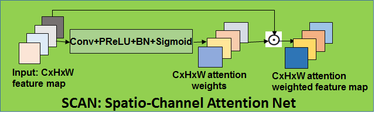
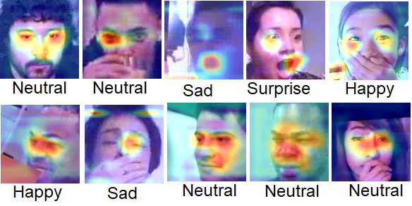

# ABAW2020 DMACS SSSIHL
<strong>This is code for our submission in the expression track of ABAW 2020 competition.</strong>

<strong> Results: https://ibug.doc.ic.ac.uk/resources/fg-2020-competition-affective-behavior-analysis/ </strong>

Link to Presentation in FG-2020: https://drive.google.com/file/d/1loxCTklHu5hhkA_3pq7qIGrmZZ7HoP_y/view?usp=sharing 

<strong>Title</strong>: Affect expression behaviour analysis in the wild using spatio-channel attention and Complementary Context Information

Paper: http://arxiv.org/abs/2009.14440
 
<strong> Our proposed FER framework:</strong>

<strong>Spatio-Channel Attention Network(SCAN) :</strong>

<strong> Some of GRADCAM visualizations on Test set images using our model:</strong>

<strong> <em>Link to annotations and checkpoints </em></strong>

 https://drive.google.com/drive/folders/1xdWb3OKcl1jTPs7DeMI2Mi58Ei5UTAyi?usp=sharing
