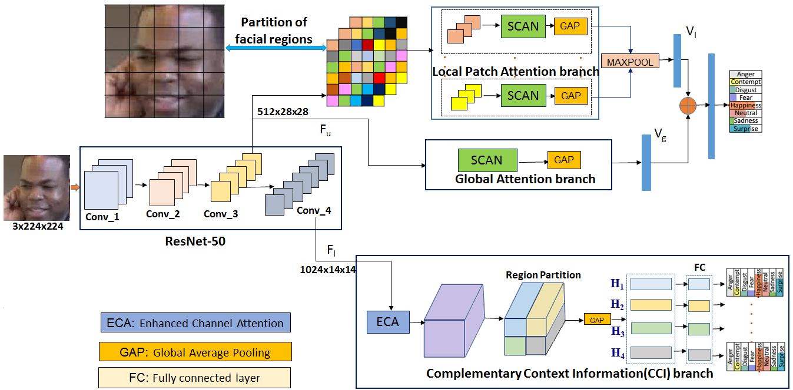

# ABAW2020DMACS
This is code for our submission in the expression track of ABAW 2020 competition.

Title: Affect expression behaviour analysis in the wild using spatio-channel attention and Complementary Context Information

<strong> Our proposed FER framework:<strong>

